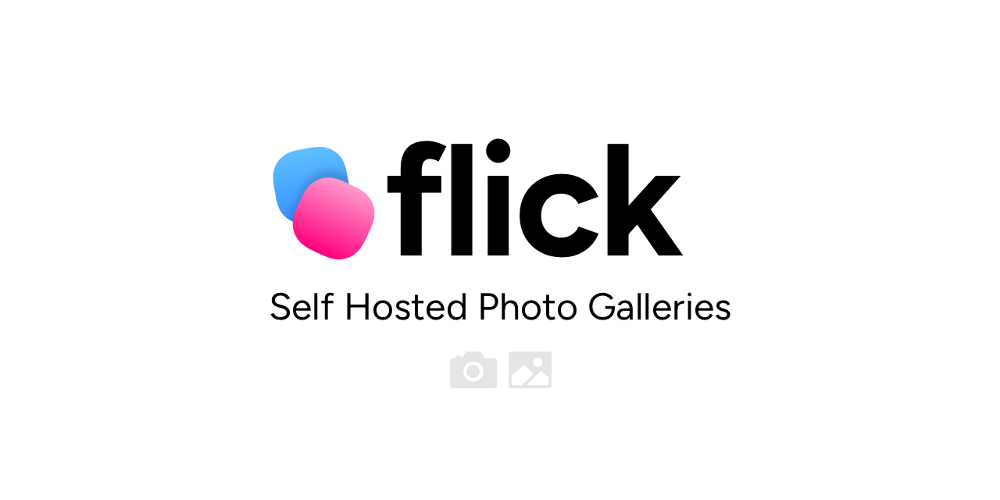

# Flick —  Simple Self Hosted Photo Albums

**⚠️ Note: This application is still under very early development. Features may be incomplete or subject to change, and the application is not yet stable.**

Flick is a PHP application that allows you to easily manage and display photo albums with features like on-the-fly image resizing, password protection, and clean URLs. This README will guide you through setting up the application, managing your albums, theming, and more.

## Table of Contents

1. [Getting Started](#getting-started)
2. [Directory Structure](#directory-structure)
3. [Adding Albums and Photos](#adding-albums-and-photos)
4. [Metadata and Password Protection](#metadata-and-password-protection)
5. [Theming with Blade](#theming-with-blade)
6. [Security Features](#security-features)
7. [Using Carbon for Date Formatting](#using-carbon-for-date-formatting)
8. [Troubleshooting](#troubleshooting)

## Getting Started

### Prerequisites

- **PHP 8.0++** (with `GD` or `Imagick` for image processing and `EXIF` for metadata extraction)
- **Composer** (for dependency management)
- **Web Server** (e.g., Apache, Nginx) or PHP's built-in server for local development

### Installation

1. **Clone the repository:**

   ```bash
   git clone https://github.com/chrissy-dev/flick.git flick
   cd flick
   ```

2. **Install dependencies:**

   Run the following command to install the necessary PHP libraries via Composer:

   ```bash
   composer install
   ```

3. **Set up the cache directory:**

   Ensure that the cache directory (`cache/`) exists and is writable:

   ```bash
   mkdir cache
   chmod 775 cache
   ```

4. **Run the application:**

   You can start the application using PHP's built-in server:

   ```bash
   php -S localhost:8000 -t public
   ```

   Alternatively, configure your web server to serve the `public/` directory as the document root.

### Accessing the Application

Once the application is running, you can access it via your web browser at:

```
http://localhost:8000
```

## Directory Structure

Here is an overview of the application's directory structure:

```
flick/
├── app/
│   ├── Controllers/
│   ├── Models/
│   ├── Utilities/
├── public/
│   ├── index.php
│   ├── images/            # Cached and resized images
│   ├── themes/            # Theme assets, copied from theme folder
├── views/                 # Blade templates
│   ├── index.blade.php
│   ├── album.blade.php
│   ├── password.blade.php
├── albums/                # Place your albums here
│   ├── example-album/
│   │   ├── image1.jpg
│   │   ├── image2.png
│   │   └── meta.md        # Metadata file
├── cache/                 # Blade cache directory
├── composer.json
├── composer.lock
└── README.md
```

### Key Directories

- **`public/`:** Contains the entry point (`index.php`) and serves static files, including resized images.
- **`albums/`:** Place your photo albums here. Each album should be a directory containing your photos and a `meta.md` file for metadata.
- **`views/`:** Contains the Blade templates used for rendering the frontend of the application.
- **`cache/`:** Stores cached views generated by Blade.

## Adding Albums and Photos

To add a new album, create a directory inside the `albums/` folder. Inside this directory, place your high-resolution images. The application will automatically resize and cache the images as needed. Keep in mind though, the bigger the image, the more processing that's needed. 

### Example:

1. **Create a new album:**

   ```
   mkdir albums/my-vacation
   ```

2. **Upload photos:**

   Place your images inside the `albums/my-vacation/` directory:

   ```
   albums/my-vacation/
   ├── photo1.jpg
   ├── photo2.png
   └── meta.md
   ```

3. **Access the album:**

   Once the photos are uploaded, you can view the album by navigating to:

   ```
   http://localhost:8000/album/my-vacation
   ```

## Metadata and Password Protection

Each album can have a `meta.md` file that contains metadata about the album. The `meta.md` file uses YAML front matter for metadata and Markdown for content.

### Example `meta.md` File:

```yaml
---
title: My Vacation
date: 2023-08-16
secret: "mypassword"  # Optional: Add a password to protect the album
---

This album contains photos from my vacation to Scotland.

This whole section of the meta.md file is Markdown, go wild.
```

### Metadata Fields:

- **`title`:** The display name of the album.
- **`date`:** The date associated with the album (e.g., when the photos were taken).
- **`secret`:** (Optional) A password that must be entered to view the album.

### Password Protection:

If you add a `secret` field in the `meta.md` file, the album will be password protected. Users will need to enter the correct password to access the album. The password can be stored as plain text or encoded for now. In the future I would be good to support some form of application key encryption.

## Theming with Blade

The application uses the Blade templating engine for theming. You can customise the look and feel of the application by modifying the Blade templates inside the `themes/<theme>` directory.

### Available Templates:

At a minimum a theme should contain the following:

- **`index.blade.php`:** The homepage that lists all the albums.
- **`album.blade.php`:** Displays photos within a specific album.
- **`password.blade.php`:** The password prompt for password-protected albums.

### Example of Customising the Theme:

You can modify the `index.blade.php` template to change the layout of the album listing:

```blade
<ul>
    @foreach ($albums as $album)
        <li>
            <a href="/album/{{ urlencode($album['name']) }}">
                {{ $album['title'] }}
            </a> 
            @if ($album['date'])
                - {{ \Carbon\Carbon::parse($album['date'])->format('F j, Y') }}
            @endif
        </li>
    @endforeach
</ul>
```

#### CSS

The core application looks for a compiled css file within the root of the theme folder with the same name as the theme folder. For example, For the theme `themes/stog` the application will look for `themes/stog/stog.css`. This file is copied to public automatically.

## Using Carbon for Date Formatting

The application uses the Carbon library to format dates in a human-readable format. Carbon is a powerful date and time manipulation library for PHP.

### Example Usage in Blade Templates:

```blade
@if ($album['date'])
    - {{ \Carbon\Carbon::parse($album['date'])->format('F j, Y') }}
@endif
```

You can customise the date format using any valid date format string. For more information on Carbon, refer to the [official documentation](https://carbon.nesbot.com/docs/).

## Troubleshooting

### Common Issues

1. **Blank Page:**
   - Ensure that PHP error reporting is enabled and check the logs for any errors.
   - Make sure that all Composer dependencies are installed.

2. **Images Not Displaying:**
   - Verify that the `public/images/` directory is writable and that images are being cached correctly.
   - Check that the `GD` or `Imagick` extension is installed and enabled in PHP.

3. **Password Not Working:**
   - Ensure that the password in the `meta.md` file matches the one being entered.

## Final Note
**⚠️ Note: This application is still under very early development. Features may be incomplete or subject to change, and the application is not yet stable.**
